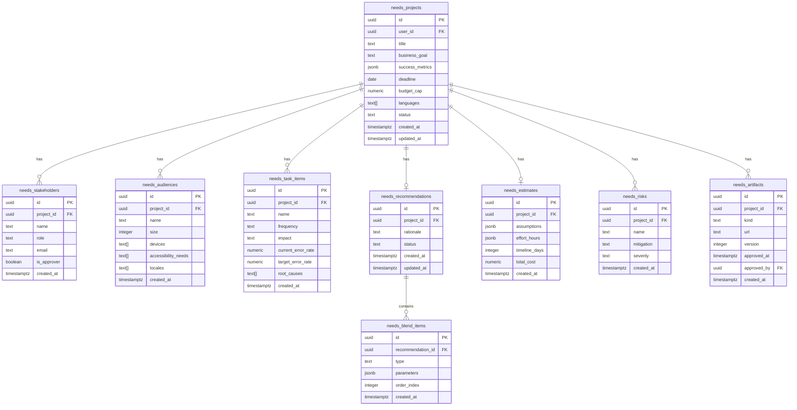

# Needs Analysis Data Model

## Entity Relationship Diagram



## Table Descriptions

### needs_projects
Core project entity containing high-level information about the needs analysis.

**Key Fields:**
- `status`: Tracks project lifecycle (draft → in_progress → completed → approved)
- `success_metrics`: Flexible JSON storage for KPIs
- `languages`: Array of ISO language codes

### needs_stakeholders
People involved in or impacted by the training initiative.

**Key Fields:**
- `is_approver`: Boolean flag for approval permissions
- Links to project via foreign key

### needs_audiences
Target learner groups with their characteristics.

**Key Fields:**
- `devices`: Array of device types (desktop, mobile, tablet, etc.)
- `accessibility_needs`: WCAG requirements
- `locales`: Language/region combinations

### needs_task_items
Specific tasks being analyzed for performance improvement.

**Key Fields:**
- `frequency`: How often the task is performed
- `impact`: Business criticality rating
- `root_causes`: Array of identified issues

### needs_recommendations
AI-generated or manually created training recommendations.

**Key Fields:**
- `rationale`: Explanation of why this approach is recommended
- One-to-one relationship with project

### needs_blend_items
Individual components of a blended learning solution.

**Key Fields:**
- `type`: Learning modality (microlearning, job_aid, ilt, etc.)
- `parameters`: Flexible JSON for modality-specific data
- `order_index`: Sequence in the learning path

### needs_estimates
Cost and timeline projections.

**Key Fields:**
- `effort_hours`: JSON breakdown by role
- `assumptions`: Array of estimation assumptions

### needs_risks
Identified project risks and mitigation strategies.

**Key Fields:**
- `severity`: Risk level (low, medium, high)
- `mitigation`: Proposed risk reduction approach

### needs_artifacts
Generated deliverables (reports, statements of work, etc.).

**Key Fields:**
- `kind`: Type of artifact
- `version`: Supports multiple versions
- `approved_at/by`: Approval tracking

## Indexes

Performance indexes are created on:
- All foreign key columns
- Project status field
- User ID for fast project listing

## Row Level Security

All tables have RLS enabled with policies ensuring:
- Users can only access their own projects
- Related data accessible via project ownership
- No cross-user data leakage

## Data Relationships

### One-to-Many
- Project → Stakeholders
- Project → Audiences  
- Project → Task Items
- Project → Risks
- Project → Artifacts
- Recommendation → Blend Items

### One-to-One
- Project → Recommendation
- Project → Estimate

## JSON Field Schemas

### success_metrics
```json
{
  "metric_name": "target_value",
  "customer_satisfaction": "90%",
  "error_reduction": "50%"
}
```

### effort_hours
```json
{
  "instructionalDesign": 120,
  "contentDevelopment": 180,
  "mediaProduction": 60,
  "qualityAssurance": 40,
  "projectManagement": 30,
  "total": 430
}
```

### blend_item parameters
```json
{
  "duration": "30 minutes",
  "format": "video",
  "interactions": ["quiz", "scenario"],
  "deliveryMethod": "self-paced"
}
```
