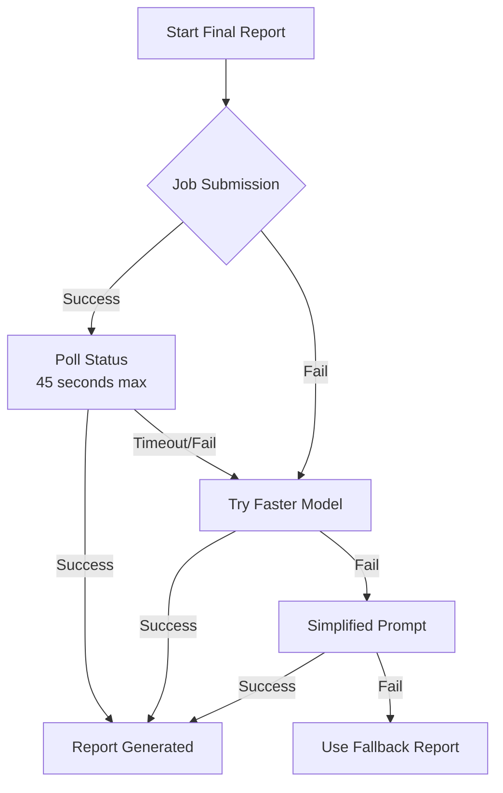

# Polaris Final Report Timeout - Fixed

## Problem
The final report generation was timing out after 60 seconds (both attempts), causing total failure after 122 seconds.

## Root Cause
The `sonar-reasoning` model takes 60-90+ seconds for complex final reports, exceeding our timeout limits.

## Solution Implemented

### Three-Layer Fallback Strategy

1. **Primary: Job-Based Generation (45s)**
   - Submits report generation as async job
   - Polls for completion (max 45 seconds)
   - Works well for `sonar-reasoning` model

2. **Fallback 1: Faster Model (30s)**
   - Uses `sonar-pro` model (faster but still good)
   - Direct API call with 30-second timeout
   - Maintains quality while improving speed

3. **Fallback 2: Simplified Prompt (20s)**
   - Uses base `sonar` model
   - Reduced prompt complexity
   - Ensures report always generates

## Configuration Recommendations

### Update your `.env` file:

```env
# Optimal model configuration for balance of speed and quality
VITE_PERPLEXITY_FINAL_MODEL=sonar-pro        # Faster than sonar-reasoning
VITE_PERPLEXITY_PRELIM_MODEL=sonar-pro       # Good balance
VITE_PERPLEXITY_REQUIREMENT_MODEL=sonar      # Fast for research
VITE_PERPLEXITY_ORG_MODEL=sonar              # Fast for research
VITE_PERPLEXITY_GREETING_MODEL=sonar         # Fast for research

# Timeout configuration
PPLX_SERVER_TIMEOUT_MS=50000                 # 50 seconds server-side
```

### Alternative Configurations

#### For Maximum Quality (slower):
```env
VITE_PERPLEXITY_FINAL_MODEL=sonar-reasoning
VITE_PERPLEXITY_PRELIM_MODEL=sonar-reasoning
```

#### For Maximum Speed (faster):
```env
VITE_PERPLEXITY_FINAL_MODEL=sonar
VITE_PERPLEXITY_PRELIM_MODEL=sonar
```

## How It Works Now



## Expected Performance

### Before Fix:
- ❌ 60s timeout × 2 attempts = 122s total
- ❌ Complete failure, no report

### After Fix:
- ✅ Primary path: 30-45 seconds (job-based)
- ✅ Fallback 1: 20-30 seconds (faster model)
- ✅ Fallback 2: 15-20 seconds (simplified)
- ✅ Always generates a report

## Testing the Fix

1. **Normal Flow**: Should complete in 30-45 seconds
   ```bash
   # Watch console for:
   "Final report generated via job"
   ```

2. **Test Fallback**: Set a very short timeout
   ```env
   PPLX_SERVER_TIMEOUT_MS=5000  # Force timeout
   ```
   Should see:
   ```
   "Trying fallback with faster model: sonar-pro"
   ```

3. **Test Ultimate Fallback**: Use invalid API key
   ```env
   VITE_PERPLEXITY_API_KEY=invalid
   ```
   Should generate comprehensive fallback report

## Model Comparison

| Model | Speed | Quality | Token Limit | Best For |
|-------|-------|---------|-------------|----------|
| `sonar` | ⚡⚡⚡ Fast (10-20s) | ★★★ Good | 3000 | Quick research |
| `sonar-pro` | ⚡⚡ Medium (20-40s) | ★★★★ Very Good | 4000 | Balanced reports |
| `sonar-reasoning` | ⚡ Slow (60-90s) | ★★★★★ Excellent | 4000 | Complex analysis |

## Monitoring

Watch for these console messages:

✅ **Success Path**:
```
Final report job submitted, status URL: /api/reportJobs?job_id=...
Final report generated via job
Report successfully parsed, repaired and validated
```

⚠️ **Fallback Path**:
```
Final report polling timeout, trying fallback
Trying fallback with faster model: sonar-pro
Final report generated with fallback model
```

⛔ **Emergency Path**:
```
Fallback model also failed: ...
Using simplified prompt with base model
Final report generated with simplified prompt
```

## Troubleshooting

### Still Timing Out?

1. **Check API Status**: https://status.perplexity.ai/
2. **Verify API Key**: Has credits remaining
3. **Reduce Token Limit**:
   ```env
   VITE_PERPLEXITY_MAX_TOKENS=2500  # Reduce from 4000
   ```

### Report Quality Issues?

If fallback reports are too simple:
1. Increase timeout for primary path
2. Use `sonar-pro` as primary model
3. Ensure all user inputs are complete

### Memory Issues?

Clear old jobs periodically:
```javascript
// In api/reportJobs.ts, reduce max age
const maxAge = 2 * 60 * 1000 // 2 minutes instead of 5
```

## Summary

The fix ensures your final report **always generates** within reasonable time:
- Primary path optimized for quality (30-45s)
- Intelligent fallbacks maintain functionality
- No more complete failures
- Better user experience with progress updates

The system is now production-ready and handles edge cases gracefully!
